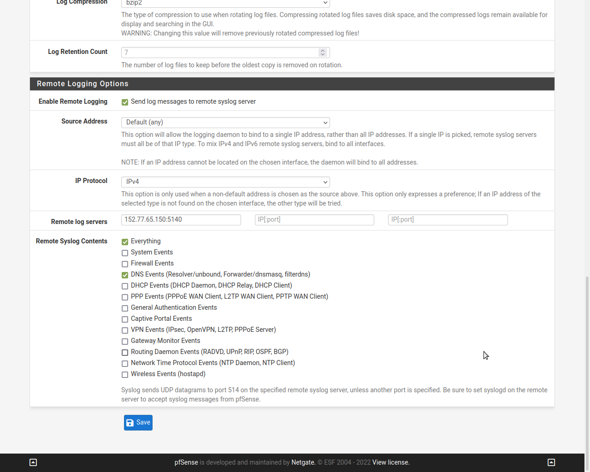

# Academic project history

## Failed Steps

Installing Graylog in container over VirtualBox VM on a physical machine with HDD.

reason: HW failure

## Consequent workflow

### Management VM setup

OS: ubuntu 20.04 LTS - Mate

Software:

* VSCode
* AnyDesk

Remote machine software:
VMware Remote Console

### Log Server Setup

OS: ubuntu 20.04 LTS - Mate

Software:

* docker
* docker-compose

Containers:

* Portainer (management web-interface)
* Graylog stacked with
  * MongoDB
  * ElasticSearch

TODO

* ntp

#### docker Installation

install packages to allow apt to use a repository over HTTPS:

    #apt-get install \
    >     ca-certificates \
    >     curl \
    >     gnupg \
    >     lsb-release

then Add Docker’s official GPG key

    $curl -fsSL https://download.docker.com/linux/ubuntu/gpg | sudo gpg --dearmor -o /usr/share/keyrings/docker-archive-keyring.gpg

set up the stable repository

    echo \
    "deb [arch=$(dpkg --print-architecture) signed-by=/usr/share/keyrings/docker-archive-keyring.gpg] https://download.docker.com/linux/ubuntu \
    $(lsb_release -cs) stable" | sudo tee /etc/apt/sources.list.d/docker.list > /dev/null

Update the `apt` package index, and install the latest version of Docker Engine and containerd

    # apt-get update
    # apt-get install docker-ce docker-ce-cli containerd.io

#### docker-compose v2 installation

    # curl -L "https://github.com/docker/compose/releases/download/1.29.2/docker-compose-$(uname -s)-$(uname -m)" -o /usr/local/bin/docker-compose

    # chmod +x /usr/local/bin/docker-compose

#### pulling the repo

    git clone https://github.com/git4vas/wirework.git

Added .env to store the password hash

### ssh access with certificate

logman machine (.158)

keygen

    $ ssh-keygen -q -N '' -b 4096 -f ~/.ssh/mykeyfile
    $ cat mykeyfile.pub
    $ nano ~/.ssh/config
    
config:
    
    Host logbox                     <- alias
    HostName 152.77.65.150          <- hostname or ip
    User logger                     <- user-name on remote machine
    Port 22                         <- (optional if 22)
    IdentityFile ~/.ssh/mykeyfile   <- path to private key

copy public key to logbox server (.150)

    $ ssh-copy-id -i ~/.ssh/mykeyfile.pub logger@152.65.77.150

test on .158

    $ ssh -Tvvv logbox

### configuring inputs

    allow_override_date:       true
    bind_address:              0.0.0.0
    expand_structured_data:    false
    force_rdns:                true
    number_worker_threads:     1
    override_source:           <empty>
    port:                      5140
    recv_buffer_size:          262144
    store_full_message:        false

#### cisco switch

    Switch>enable
    Switch#configure terminal
    Switch(config)# logging host     [logging 172.16.10.51] or [logging 172.16.10.51 transport udp port 5140]
    Switch(config)# logging trap level [default level is informational]
    Switch(config)# end

#### pfsense router

#### linux host

    # nano /etc/rsyslog.d/80-graylog.conf

config rsyslog daemon to send UDP messages in syslog format to the logbox server (.150)

    *.* @152.77.65.150:5140;RSYSLOG_SyslogProtocol23Format

###